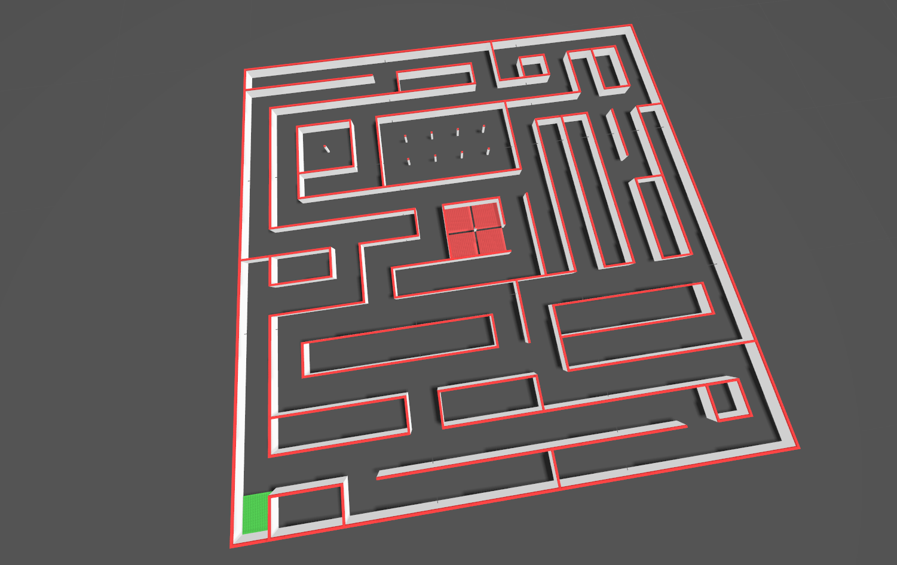
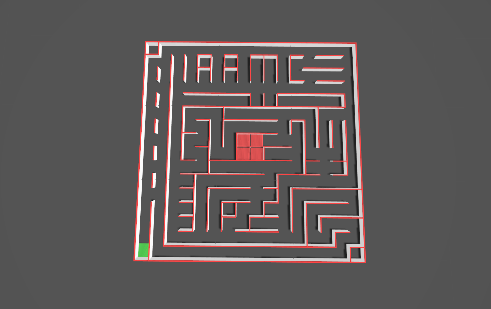

# gazebo Maze-Gen

A **Gazebo Ignition Fortress** (`gz-sim 6`) world-system plugin that reads a
[micromouseonline](https://github.com/micromouseonline/mazefiles)-format
text maze file and spawns the corresponding walls, posts, and
start/goal markers into a running world.


| | |
|---|---|
| Library (SDF `filename=`) | `libmazegen_plugin.so` |
| Plugin class (SDF `name=`) | `mazegen::MazegenPlugin` |
| Plugin type | World system (`ISystemConfigure`) |
| Default cell size | 180 mm (classic micromouse) |
| Default wall | 12 mm thick x 50 mm tall, white sides, red top |
| Default posts | 12 x 12 x 50 mm at every grid intersection |
| Example floor | Non-gloss black ([`worlds/maze.sdf`](./worlds/maze.sdf)) |

Geometry and colours follow the official
[micromouse maze rules](https://micromouseonline.com/micromouse-book/mazes-and-maze-solving/):
the maze is a 16 x 16 array of 180 mm unit squares, walls are 50 mm
high and 12 mm thick with white sides and red tops, lattice posts are
12 x 12 x 50 mm, and the example world's floor is non-gloss black.

## Gallery

Bundled mazes rendered in Ignition Fortress (green = start cell, red = goal):

| `mazes/alljapan-001-1980.txt` | `mazes/allamerica2013.txt` |
|---|---|
| | |

---

## 1. Maze file format

Plain text, as used by
[`micromouseonline/mazefiles`](https://github.com/micromouseonline/mazefiles):

```
o---o---o---o---o---o
|       |       |   |
o   o   o   o   o   o
|   |       |   |   |
o   o   o   o   o   o
|   |   |   | G |   |
o---o   o   o---o   o
|       |       |   |
o   o   o---o   o   o
| S |       |       |
o---o---o---o---o---o
```

* `o`   : post at a grid intersection. 
* `---` : horizontal wall segment between two posts.
* `|`   : vertical wall segment between two posts.
* `S`   : start cell (green floor tile).
* `G`   : goal cell(s) (red floor tile).

The bottom-most text row is maze row 0; the left-most column
is column 0.

---

## 2. Docker (recommended)

The fastest way to run the project: no host dependencies beyond Docker and an X server.
Full details are in **[docker/README.md](./docker/README.md)**; the essentials are below.

### Build

```bash
# from repo root
docker build -f docker/Dockerfile -t mazegen-gazebo .
```

### Run (default maze)

```bash
xhost +local:docker
docker compose -f docker/docker-compose.yml up
```

### Run (custom maze)

```bash
xhost +local:docker
docker run --rm \
  -e DISPLAY=$DISPLAY \
  -v /tmp/.X11-unix:/tmp/.X11-unix \
  -v /path/to/your/maze.txt:/workspace/mazes/custom.txt \
  mazegen-ign-gazebo mazes/custom.txt
```

GPU options (Intel/AMD `--device /dev/dri --group-add video`, NVIDIA `--gpus all`)
and Compose-based custom-maze mounting are covered in [docker/README.md](./docker/README.md).

---

## 3. Build from source

System prerequisites (Ubuntu 20.04 / 22.04 with Fortress installed):

```bash
sudo apt install \
  libignition-gazebo6-dev libignition-plugin-dev \
  libignition-common4-dev libignition-math6-dev \
  libignition-msgs8-dev libignition-transport11-dev \
  libsdformat12-dev cmake build-essential
```

Build:

```bash
git clone https://github.com/svaibhav101/mazegen_gazebo.git
cd mazegen_gazebo
mkdir build
cmake -S . -B build
cmake --build build -j
```

This produces `build/libmazegen_plugin.so`.

### Run the unit tests

The maze-file parser is covered by a CTest target (enabled by default):

```bash
ctest --test-dir build --output-on-failure
# or run the binary directly: build/test_maze_parser
```

### Generate API docs (optional)

If Doxygen is installed, a `doc` target renders the in-source docs:

```bash
cmake --build build --target doc
# output: build/docs/html/index.html
```

---

## 4. Run the bundled example (no install)

From the repo root, source the helper that exports the two search paths:

```bash
source setup.bash          # sets IGN_GAZEBO_SYSTEM_PLUGIN_PATH + RESOURCE_PATH
ign gazebo -v 4 worlds/maze.sdf
```

`setup.bash` is just:

```bash
export IGN_GAZEBO_SYSTEM_PLUGIN_PATH=$PWD/build:$IGN_GAZEBO_SYSTEM_PLUGIN_PATH
export IGN_GAZEBO_RESOURCE_PATH=$PWD:$IGN_GAZEBO_RESOURCE_PATH
```

`IGN_GAZEBO_SYSTEM_PLUGIN_PATH` lets Ignition find the `.so`;

`IGN_GAZEBO_RESOURCE_PATH` lets the plugin resolve the relative
`<maze_file>mazes/alljapan-001-1980.txt</maze_file>` path.

Example world bundled with loading the maze with the full
physics / scene-broadcaster stack:

* `worlds/maze.sdf` - minimal example world.

---

## 5. Install system-wide (use from any world)

To use the plugin from your own world files without setting
`IGN_GAZEBO_SYSTEM_PLUGIN_PATH` every time, install the library.

### 4a. Install with CMake

```bash
# Default prefix is /usr/local; override with -DCMAKE_INSTALL_PREFIX=...
cmake -S . -B build -DCMAKE_INSTALL_PREFIX=/usr/local
cmake --build build -j
sudo cmake --install build
```

This places:

| File | Destination |
|---|---|
| `libmazegen_plugin.so` | `<prefix>/lib/` |

Only the shared library is installed; the bundled `worlds/` and
`mazes/` stay in the source tree. Reference maze files from your world
by absolute path, or add their directory to `IGN_GAZEBO_RESOURCE_PATH`.

### 4b. Make Ignition pick it up

If `<prefix>` is `/usr/local`, add the lib dir to the plugin search path
(once, e.g. in your `~/.bashrc`):

```bash
export IGN_GAZEBO_SYSTEM_PLUGIN_PATH=/usr/local/lib:$IGN_GAZEBO_SYSTEM_PLUGIN_PATH
```

If you used a custom prefix:

```bash
export IGN_GAZEBO_SYSTEM_PLUGIN_PATH=$HOME/myprefix/lib:$IGN_GAZEBO_SYSTEM_PLUGIN_PATH
```

For maze files referenced by relative path, also expose a resource
directory containing them, e.g. the repo's `mazes/`:

```bash
export IGN_GAZEBO_RESOURCE_PATH=/path/to/gazeboMaze:$IGN_GAZEBO_RESOURCE_PATH
```

(Absolute paths in `<maze_file>` work regardless of `IGN_GAZEBO_RESOURCE_PATH`.)


---

## 6. Using `MazegenPlugin` in your own world

Drop a single `<plugin>` block inside any `<world>` element. **No other
changes** to your world are required. Your existing physics, lights,
robots, and models continue to work normally.

### Single maze

```xml
<plugin filename="libmazegen_plugin.so"
        name="mazegen::MazegenPlugin">
  <maze_file>/absolute/path/to/maze.txt</maze_file>
  <!-- All remaining params are optional; defaults shown. -->
  <model_name>maze</model_name>
  <cell_size>0.18</cell_size>            <!-- meters -->
  <wall_thickness>0.012</wall_thickness>  <!-- meters -->
  <wall_height>0.05</wall_height>         <!-- meters -->
  <post_size>0.012</post_size>            <!-- meters -->
  <wall_color>1 1 1</wall_color>          <!-- R G B, range [0, 1] -->
  <cap_color>0.9 0.05 0.05</cap_color>    <!-- R G B, range [0, 1] -->
  <origin>0 0 0 0 0 0</origin>            <!-- x y z (m)  roll pitch yaw (rad) -->
</plugin>
```

### Multiple mazes

Use one `<maze>` child block per maze. Geometry and colour params placed
directly on the `<plugin>` element are shared by all blocks; any `<maze>`
block can override them individually.

```xml
<plugin filename="libmazegen_plugin.so"
        name="mazegen::MazegenPlugin">
  <!-- shared params (all optional) -->
  <cell_size>0.18</cell_size>
  <wall_color>1 1 1</wall_color>
  <cap_color>0.9 0.05 0.05</cap_color>

  <maze>
    <file>mazes/alljapan-001-1980.txt</file>
    <model_name>japan1980</model_name>   <!-- optional; default: maze_0 -->
    <origin>0 0 0 0 0 0</origin>
  </maze>
  <maze>
    <file>mazes/allamerica2013.txt</file>
    <model_name>america2013</model_name>
    <origin>5 0 0 0 0 0</origin>         <!-- offset 5 m along X -->
  </maze>
</plugin>
```

A ready-to-run example is provided in [`worlds/two_mazes.sdf`](./worlds/two_mazes.sdf):

```bash
source setup.bash
ign gazebo -v 4 worlds/two_mazes.sdf
```

### Parameters

#### Top-level (single-maze) or shared (multi-maze)

| Tag | Type | Default | Description |
|---|---|---|---|
| `<maze_file>` | string | (required) | Path to a `.txt` maze: absolute, or relative to `IGN_GAZEBO_RESOURCE_PATH`. |
| `<model_name>` | string | `maze` | Name of the spawned model (single-maze only). |
| `<cell_size>` | double | `0.18` | Grid cell pitch, meters. |
| `<wall_thickness>` | double | `0.012` | Wall thickness, meters. |
| `<wall_height>` | double | `0.05` | Wall height, meters. |
| `<post_size>` | double | `wall_thickness` | Side of the square corner posts, meters. |
| `<wall_color>` | vec3 | `1 1 1` | Wall body colour: R G B each in `[0, 1]`. |
| `<cap_color>` | vec3 | `0.9 0.05 0.05` | Top-cap colour: R G B each in `[0, 1]`. |
| `<origin>` | 3 - 6 doubles | `0 0 0 0 0 0` | Pose of the maze SW corner: `x y z (m)` then optional `roll pitch yaw (rad)`. |

#### Per `<maze>` block (multi-maze)

| Tag | Type | Default | Description |
|---|---|---|---|
| `<file>` | string | (required) | Path to the maze `.txt` file. |
| `<model_name>` | string | `maze_<N>` | Name of the spawned model; must be unique per world. |
| `<origin>` | 3 - 6 doubles | `0 0 0 0 0 0` | World pose of this maze's SW corner. |
| geometry/colour | same as above | inherited from plugin | Any shared param can be overridden per block. |

### Transport services

Once the plugin has loaded the maze, it advertises two persistent Ignition transport services. When multiple mazes are loaded in the same world each gets its own pair of services, distinguished by `<model_name>`.

#### `/mazegen/<model_name>/spawn_pose`

Returns an `ignition::msgs::Pose` with:

- **Position**: center of the start cell in world coordinates.
- **Orientation**: yaw derived from the first open side of the start cell
  (priority: east -> north -> west -> south).

```bash
# Example: <model_name>:=allamerica2013
ign service -s /mazegen/allamerica2013/spawn_pose \
    --reqtype ignition.msgs.Empty \
    --reptype ignition.msgs.Pose \
    -r "" \
    --timeout 2000
```

#### `/mazegen/<model_name>/goal_poses`

Returns an `ignition::msgs::Pose_V` (repeated Pose) with one entry per goal cell,
in the order they appear in the maze file. A classic 16×16 micromouse goal block
contains four cells. Each entry carries:

- **Position**: center of the goal cell in world coordinates.
- **Orientation**: identity (goal cells have no facing direction).

```bash
# Example: <model_name>:=allamerica2013
ign service -s /mazegen/allamerica2013/goal_poses \
    --reqtype ignition.msgs.Empty \
    --reptype ignition.msgs.Pose_V \
    -r "" \
    --timeout 2000
```


---

## 7. Repository layout

```bash
.
├── build                          # CMake build tree (generated; .so + tests)
├── CMakeLists.txt                 # CMake configuration
├── .dockerignore                  # excludes build/, .git/, docs from Docker context
├── docker
│   ├── Dockerfile                 # container image (Ubuntu 22.04 + Ignition Fortress)
│   ├── docker-compose.yml         # convenience Compose wrapper
│   ├── entrypoint.sh              # runtime script: patch maze path, launch ign gazebo
│   └── README.md                  # Docker-specific usage guide
├── documentation
│   └── Doxyfile                   # Doxygen config
├── include
│   ├── mazegen_plugin.h           # public plugin class (mazegen::MazegenPlugin)
│   └── maze_parse.h               # Maze struct + ParseMazeFile() declaration
├── mazes                          # bundled micromouseonline-format competition mazes
├── README.md
├── setup.bash                     # sets IGN_GAZEBO_SYSTEM_PLUGIN_PATH + RESOURCE_PATH
├── src
│   ├── mazegen_plugin.cpp         # plugin: parse maze, build SDF, spawn via /create
│   └── maze_parse.cpp             # maze-file parser implementation
├── test
│   └── test_maze_parser.cpp       # CTest unit tests for the parser
└── worlds
    ├── maze.sdf                   # single-maze example world
    └── two_mazes.sdf              # multi-maze example (two mazes side by side)
```

---

## 8. References & acknowledgements
This project drew inspiration from previous work within the Micromouse and Gazebo communities:

* **[micromouseonline/mazefiles](https://github.com/micromouseonline/mazefiles)**
  - the plain-text maze file format this plugin parses, and the source of
  the bundled competition mazes in `mazes/`.
* **[PeterMitrano/gzmaze](https://github.com/PeterMitrano/gzmaze)** - a
  maze generator for Gazebo 11 (Gazebo Classic).
* **([Micromouse maze rules](https://micromouseonline.com/micromouse-book/mazes-and-maze-solving/))  & ([UK-micromouse-classic](https://ukmars.org/contests/contest-rules/micromouse-classic/))**
  - the official geometry and colour spec the defaults
  follow: 16×16 grid of 180 mm cells, 50 mm x 12 mm walls with white
  sides and red tops, 12 mm lattice posts, non-gloss black floor.
* **[Ignition Gazebo Fortress](https://gazebosim.org/docs/fortress)** -
  the simulator and plugin/transport APIs (`gz-sim 6`, `ignition-plugin`,
  `ignition-transport`, `ignition-msgs`, `sdformat12`) this plugin targets.


## License

`mazegen_gazebo` is made available under the Apache License 2.0. For more details, see [LICENSE](./LICENSE)